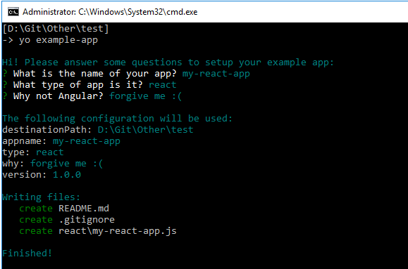

# Example generator for Yeoman

This is a working [Yeoman](https://yeoman.io/) example generator.



## Prerequisites

- node.js
- npm

## Install

Since this is just an example generator, the package isn't published to a public registry. Instead, you can clone this repository and install it locally.

1.  Install Yeoman globally

```ps
npm install -g yo
```

2. Clone this repository

```ps
git clone https://github.com/jizza/generator-example-app.git
```

3. Step into the folder

```ps
cd generator-example-app
```

4. Install the package's dependencies

```ps
npm install
```

5. Install the package locally

```
npm link
```

## Run

1. Create a new folder
2. Run the generator

```ps
yo example-app
```
